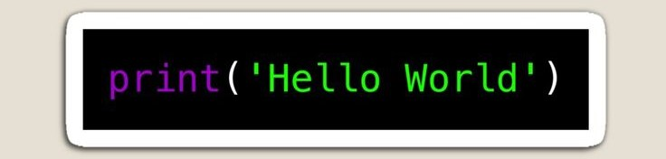

# Sarah-HAMITOUCHE

<h1 align="center">Hi 👋, I'm Sarah HAMITOUCHE</h1>

<h3 align="center">A passionate web developer from France</h3>

🎓 A student at **La Plateforme school**, passionate about web development and creation.  
💻 Specialized in both **front-end** and **back-end** technologies, I'm eager to apply my skills through an internship.  
🚀 Always looking for new, exciting projects to learn and grow.

- 🌱 I’m currently learning **python, javascript, php and photoshop**

- **Tools**: Git, GitHub, VS Code

- 🤝 I’m looking for help with **the teachers**

- 📝 I regularly write articles on WATTPAD

- 📫 How to reach me **sarah.hamitouche@laplateforme.io**

- 📄 Know about my experiences [https://drive.google.com/file/d/1KJcLsv74SGERf_iwtnBAKCM3xiZ_hQhv/view?usp=drive_link](https://drive.google.com/file/d/1KJcLsv74SGERf_iwtnBAKCM3xiZ_hQhv/view?usp=drive_link)
- "Code is poetry for computers" 💡

- ⚡ Fun fact **i love art and i sometimes play piano**

<h3 align="left">Connect with me:</h3>
- LinkedIn: https://www.linkedin.com/in/sarah-hamitouche-1a766a256/
<h3 align="left">Languages and Tools:</h3>

        

